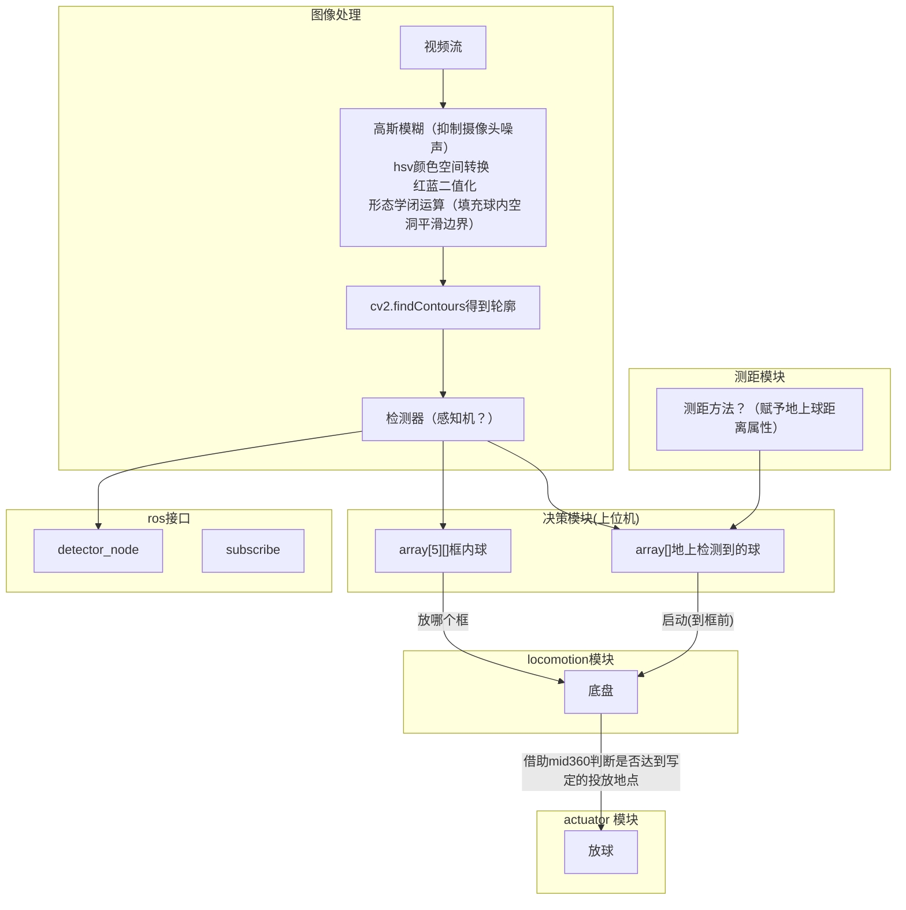

# 球部识别

```mermaid
flowchart TB;
    subgraph "决策模块(上位机)"
         7["array[]地上检测到的球"]
         9["array[5][]框内球"]
    end
    subgraph 图像处理
        1[视频流]-->5[高斯模糊（抑制摄像头噪声）<br>hsv颜色空间转换 <br> 红蓝二值化<br> 形态学闭运算（填充球内空洞平滑边界）]-->3[cv2.findContours得到轮廓]-->6[检测器（感知机？）]
        6-->7
        6-->9
    end


    subgraph 测距模块
        8[测距方法？（赋予地上球距离属性）]-->7
    end

    subgraph ros接口
        6-->88[detector_node]
        subscribe
    end

    subgraph locomotion模块
        7--启动(到框前)-->10[底盘]
        9--放哪个框-->10
    end

    subgraph actuator 模块
        10--借助mid360判断是否达到写定的投放地点--> 13[放球]
    end


```