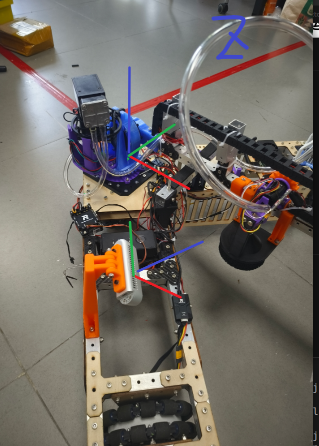

## 球部坐标定位
- ```inferencer_node```文件：球部识别的节点文件
- ```inferencer.cpp```文件：onnx加速下的yolov8核心文件
- ```include/yolov8.hpp```文件：TensorRT加速下的yolov8核心文件
---
## 不同平台运行注意事项
- 注意在CMakeLists.txt中指定要```CUDA```架构和GPU加速类型
- jetson上的realsense的话题是namespace是```/camera/camera```,而x86架构上的```/camera```

### 相机坐标系`cam_realsense`到机械臂坐标系`roboarm_base`的齐次变换矩阵（淘汰 ros2 tf有更好的方法）

直接使用分解法
$$
\begin{bmatrix} \frac{\sqrt2}{2} & \frac{\sqrt2}{4} &-\frac{\sqrt2}{4}&-0.315\\ \frac{\sqrt2}{2} & -\frac{\sqrt2}{4}&\frac{\sqrt2}{4}&-0.2\\0 &-\frac{\sqrt2}{2} &\frac{\sqrt2}{2}&-0.315\\0&0&0&1\end{bmatrix}$$
## 使用欧拉角表示的齐次变换
### 旋转矩阵
为方便坐标解算，我已将相机坐标系的调成下图所示
<p align="center">
  
</p>


$$ 
R=R_{yaw}(\pi/4)R_{pitch}(0)R_{roll}(\pi/4)
$$

### 平移部分
测量得（待精确更正）
$$
\begin{bmatrix} 0.315\\-0.2\\0.2\end{bmatrix}
$$