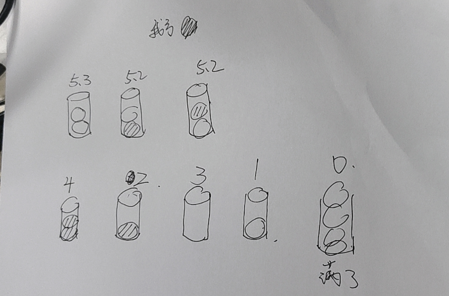

### 球框状态检测复杂度分析
**方法一**
- 从推理结果中分开框和球
- 遍历球框
	- 遍历球，计算所有球与球框的iou（bounding box的重叠占比），超过设定的阈值就把球算上在框里面

**方法二**
- 从推理结果中分开框和球
- 遍历球
	- 选出和此个球马氏/欧式距离最近的框，进行iou比较，超过设定的阈值就把球在框里面

### 目前的优先级排布
derived in hupan

	

### msg
- 由于ros2没有原生的只保留array的类型（只有multipleArray），造成资源上的浪费，故新建一个 `uint8[5]`(标准库下的`std::array<uint8_t, 5>`)作为框的状态的接口