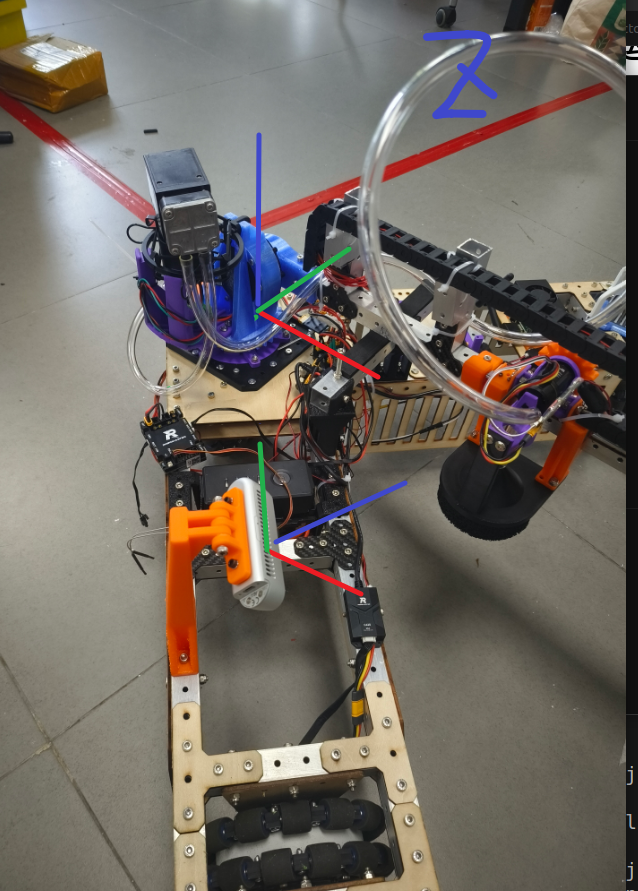
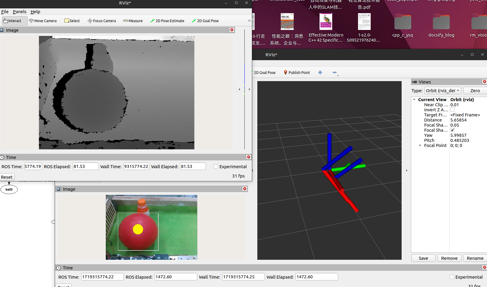
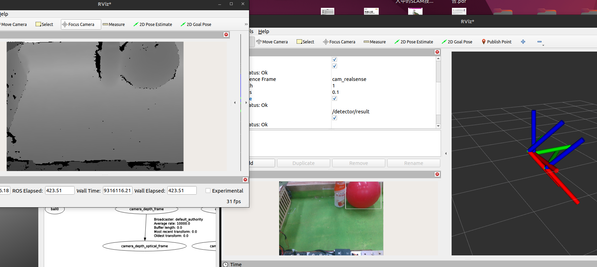
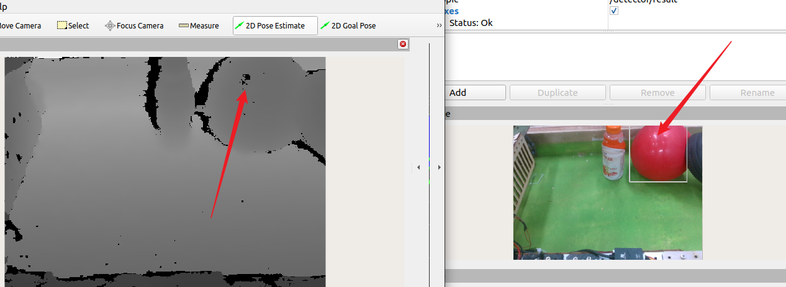

## 球部坐标定位
- ```inferencer_node```文件：球部识别的节点文件
- ```inferencer.cpp```文件：onnx加速下的yolov8核心文件
- ```include/yolov8.hpp```文件：TensorRT加速下的yolov8核心文件
---
## 不同平台运行注意事项
- 注意在CMakeLists.txt中指定要```CUDA```架构和GPU加速类型
- jetson上的realsense的话题是namespace是```/camera/camera```,而x86架构上的```/camera```


## 使用欧拉角表示的齐次变换
调参，$\pi=$`0.78539816339`
```
ros2 run rc_detector rc_projector_node --ros-args -p roll:=0.0 -p pitch:=0.785398163 -p yaw:=0.785398163 -p x:=0.315 -p y:=-0.2 -p z:=0.2
```

## 查看球部坐标坐标系和机械臂坐标的转换矩阵
```
ros2 run tf2_ros tf2_echo roboarm_base ball0
```
### 旋转矩阵
为方便坐标解算，我已将相机坐标系的调成下图所示
<p align="center">
  
</p>


$$ 
R=R_{yaw}(0)R_{pitch}(\pi/4)R_{roll}(\pi/4)
$$

### 平移部分
solidworks中测量Translation部分（mearsured in m）
$$
\begin{bmatrix} 0.2565\\-0.2385\\0.1897\end{bmatrix}
$$
### 实测结果
- 当直接去使用 bounding box 的形心作为球的深度信息(如下图黄色部分所示)
去一次在机械臂x轴正方向的0.35m处，测得球部坐标: [0.372, -0.023, -0.068]

<p align="center">
  
</p>
  放置于一次比较远的0.68m处，测得球部坐标: [0.670, -0.044, -0.073]
<p align="center">
  
</p>


- 现尝试使用bounding box的上方的点作为深度值的采样点，但是上方的反光点比较严重，不想测了
<p align="center">
  
</p>

- 使用 scale factor 方法


### 相机坐标系`cam_realsense`到机械臂坐标系`roboarm_base`的齐次变换矩阵（淘汰,应该直接使用tf2框架）

直接使用分解法
$$
\begin{bmatrix} \frac{\sqrt2}{2} & \frac{\sqrt2}{4} &-\frac{\sqrt2}{4}&-0.315\\ \frac{\sqrt2}{2} & -\frac{\sqrt2}{4}&\frac{\sqrt2}{4}&-0.2\\0 &-\frac{\sqrt2}{2} &\frac{\sqrt2}{2}&-0.315\\0&0&0&1\end{bmatrix}$$