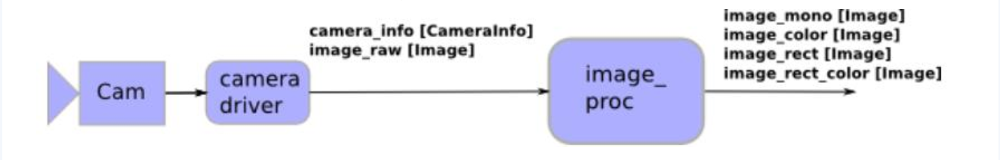

# 配置相机内参步骤

1. 相机标定，得到一个 `camera_info.yaml`标定文件
2. 
    ```
    cp camera_info.yaml /home/jetson/.ros/camera_info
    mv camera_info.yaml usb_2.0_camera\:_hd_usb_camera.yaml
    ```
3. 发布标定完成,经过校准的图像

